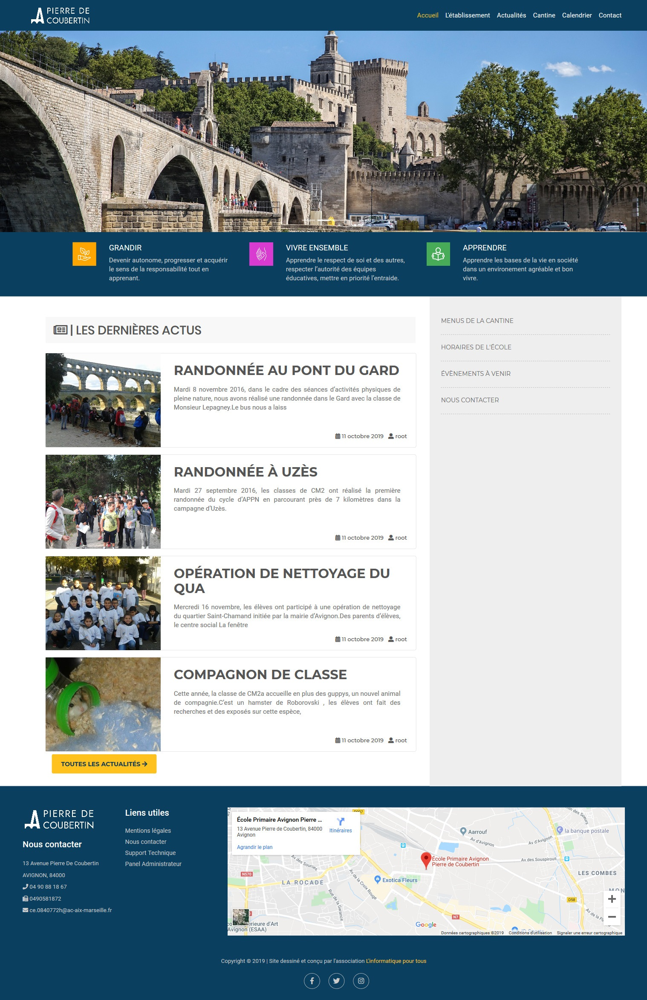
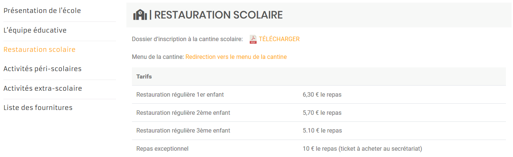
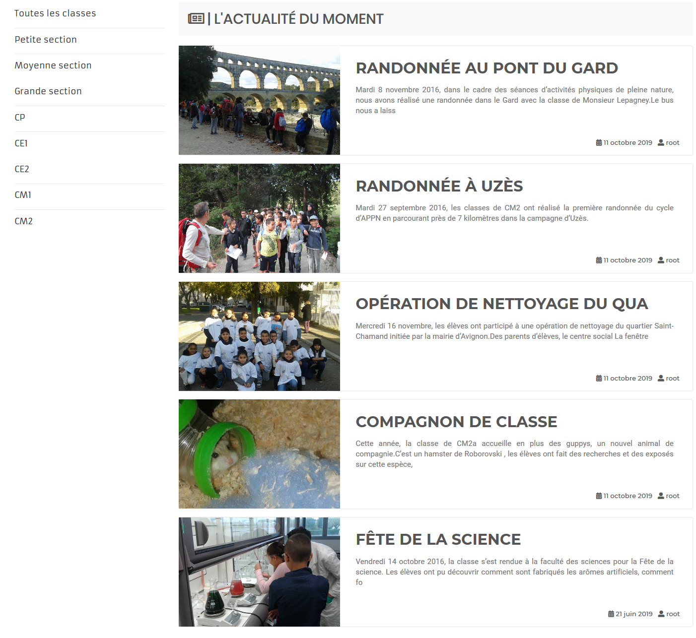
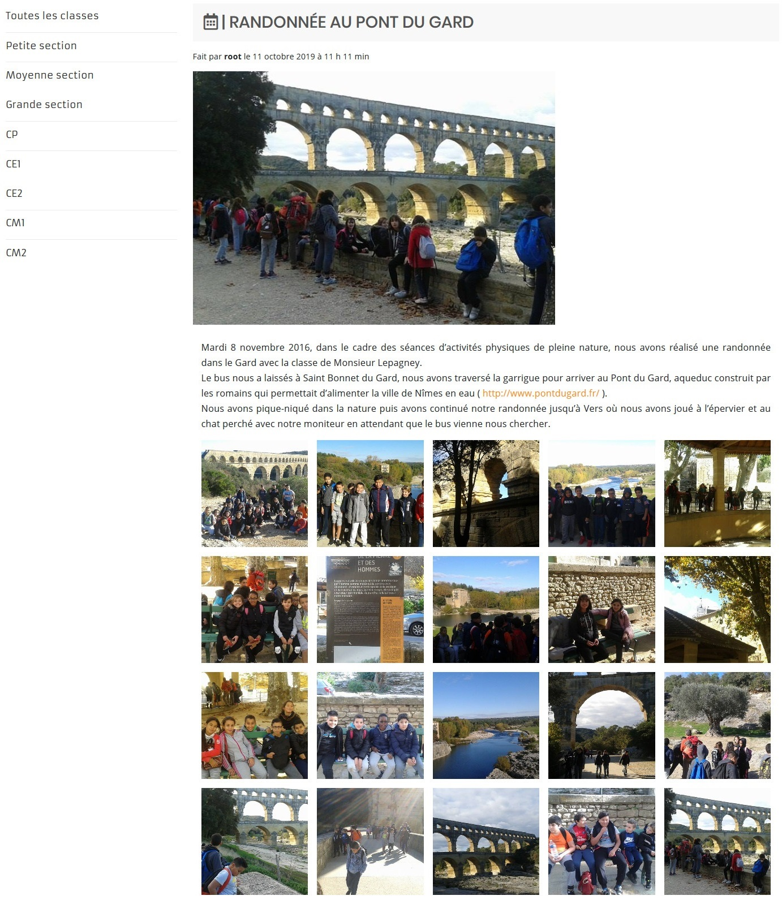

# :school: Easy School :school:

> ⚠️ Warning : This theme work on WordPress 5.0+ ⚠️

📝 Available Translations : 🇫🇷 _ 🇺🇸 _ 🇬🇧

📝 Comming Soon Translations : 🇲🇦 _ 🇹🇳 _ 🇨🇳 _ 🇮🇹 _ 🇪🇸

## What is available in this theme ?

* Quicklly customizable theme (Customizer API)
* Blog articles with gallery like instagram
* Canteen Menu
* Calendar for the futurs events
* School and activities description
* Canteen pricing table

## Description

This WordPress theme is quick to install and easy to use thanks to this modern and clear user interface.

Made in partnership with local french schools this theme is perfect for the use of public pre-school and primary school. And include all the functionnalities needed by a public school.

## Dependencies

[Canteen Menu](https://github.com/qanastek/Canteen-Menu) - For the canteen menu (Comming Soon)

[Next Events](https://github.com/qanastek/Next-Events) - For the calendar of the futurs events (Comming Soon)

[Disable Comments](https://fr.wordpress.org/plugins/disable-comments/) - For disable comments on the entire website

~~[TablePress](https://fr.wordpress.org/plugins/tablepress/) - For making quickly somes tables~~

~~[Advanced Custom Fields](https://fr.wordpress.org/plugins/advanced-custom-fields/)~~

## Installation

### Step 1 - Download:

```bash
git clone https://github.com/qanastek/Easy-School
```

or

Download the [zip file](https://github.com/qanastek/Easy-School/archive/master.zip) from GitHub.

### Step 2 - Install :

Drop the theme in your WordPress theme folder.

> [web_server]/www/wordpress/wp-content/themes/

### Step 3 - Configure your website (customize tab) :

1. In the site indentity section add :
    - Logo
    - Site title
    - Tagline
    - Site icon
2. In the theme setting section :
    - Add the 3 slider images
    - If you want change the mottos and theses icons
    - Add your social medias links
    - ⚠️ Fill up all the basics informations
    - Change the schedules according to your school
    - ⚠️ Fill up the terms of service
    - (Optional) Choose a footer
    
### Step 4 - Setup the demo website (optional)

* Go into the Install_theme directory
* Open the import tab in the WordPress settings
* Import pierredecoubertin.wordpress.2019-03-31.xml
* Go into TablePress > Import
* Import 2-tarifs-cantine-2019-03-31.csv

## Pictures

#### Home



#### Canteen prices



#### News



#### Blog Article



#### Nexts Events Calendar


#### Contact Us


## Informations about the version 2 of this theme

The main goal of the second version of this theme was to be fully compatible with wordpress 5.0+ and take advantage of the brand new features like tables, galleries and blocks. This UX improvement make the theme way simpler to interact with for beginners and make the architecture of the website more flexible.

In the same time, switching to gutemberg permit to use less plugins and make the theme even lighter. Deleting plugins from the stack also permit to improve the security of the website who using the theme.

## License

The Easy School WordPress theme is an Open Source software released under the [MIT Licence](https://choosealicense.com/licenses/mit/).
